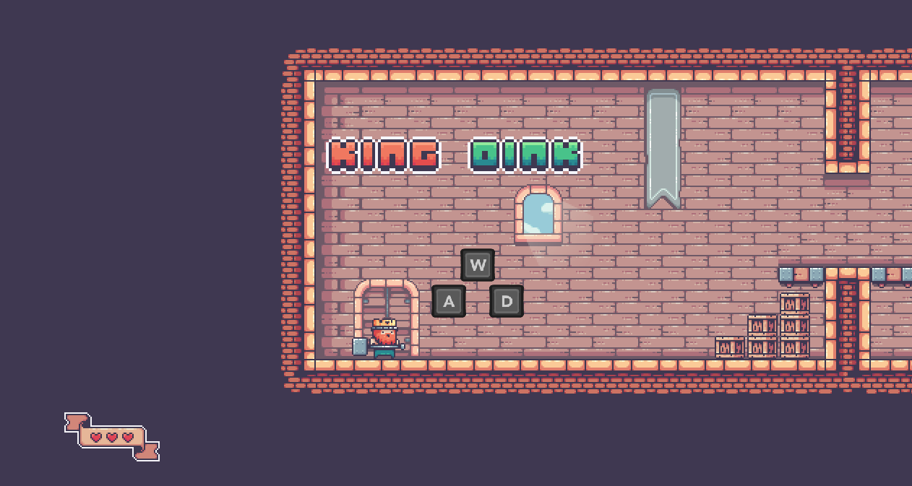
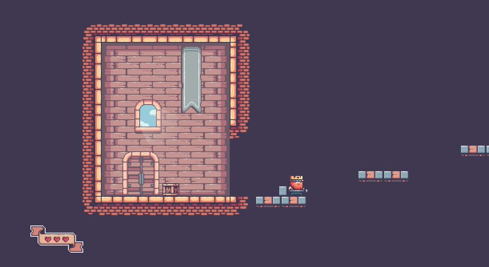

# KingOink


A fun and short little platformer made with pygame-ce! After I played around with pygame a bit, I wanted to see what else I could make that's a bit more complex than my space invaders clone... that's when I started working on King Oink!


# Controls
Movement - WASD

Jump - SPACE

Use door - ENTER

Pause - ESC

# Install instructions 
1. Clone repository

2. Make sure you have pygame installed: 
```pip install pygame-ce```

3. Run main.py
(I should probably add a release someday)

# Screenshots





# Credits
### Art:

PixelFrog (https://pixelfrog-assets.itch.io/kings-and-pigs)

Xelu (https://thoseawesomeguys.com/prompts/)

### Music:

Matthew Pablo (https://opengameart.org/content/woodland-fantasy)
